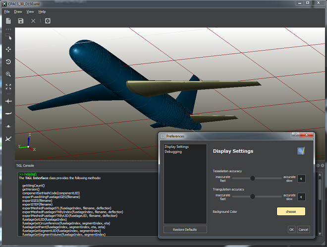

Build-Status:  

 - Binary Downloads:  https://github.com/DLR-SC/tigl/wiki/Downloads
 - API Documentation: http://tigl.sourceforge.net/Doc/index.html
 - Issue Tracker:     https://github.com/DLR-SC/tigl/issues
 - Wiki:              https://github.com/DLR-SC/tigl/wiki

# About TiGL

The **Ti**GL **G**eometry **L**ibrary can be used for the computation and processing of aircraft geometries 
stored inside [CPACS](https://github.com/DLR-LY/CPACS) files. TiGL offers many geometry related functions such as
 - Point retrieval functions to compute points on the aircraft surface
 - Intersection functions to compute the intersection of the aircraft with planes
 - Export functions for standard CAD file formats (STEP + IGES) or mesh formats, 
   including VTK, Collada, and STL.
   
The TiGL library uses the OpenCASCADE CAD kernel to represent the airplane geometry 
by NURBS surfaces. The library provides external interfaces for C, C++, Python, Java, MATLAB, and FORTRAN.

TiGL is shipped with the Qt based _TiGL Viewer_ for visualizing aircraft
geometries or viewing CAD files.

