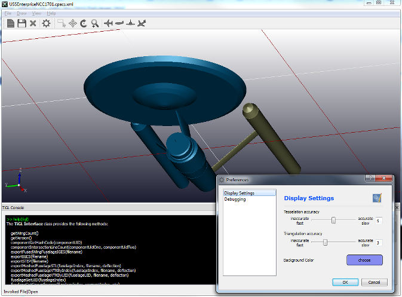

# TiGL

 
 

The **Ti**GL **G**eometry **L**ibrary can be used for the computation and processing of aircraft geometries 
stored inside [CPACS](https://github.com/DLR-LY/CPACS) files. TiGL offers many geometry related functions such as
 - Point retrieval functions to compute points on the aircraft surface
 - Intersection functions to compute the intersection of the aircraft with planes
 - Export functions for standard CAD file formats (STEP + IGES) or mesh formats, 
   including VTK, Collada, and STL.
   
The TiGL library uses the OpenCASCADE CAD kernel to represent the airplane geometry 
by NURBS surfaces. The library provides external interfaces for C, C++, Python, Java, MATLAB, and FORTRAN.

TiGL is shipped with the Qt based _TiGL Viewer_ for visualizing aircraft
geometries or viewing CAD files.

 - Binary Downloads:  https://github.com/DLR-SC/tigl/wiki/Downloads
 - Wiki:              https://github.com/DLR-SC/tigl/wiki

# News

Please head over to our TiGL website: https://dlr-sc.github.io/tigl/#news

# Cite us

TiGL is available as Open Source and we encourage anyone to make use of it. If you are applying TiGL in a scientific environment and publish any related work, please cite the following artice:

Siggel, M., Kleinert, J., Stollenwerk, T. et al.:  *TiGL: An Open Source Computational Geometry Library for Parametric Aircraft Design*, Math.Comput.Sci. (2019). https://doi.org/10.1007/s11786-019-00401-y

A free copy of the paper is offered here: https://rdcu.be/bIGUH 

