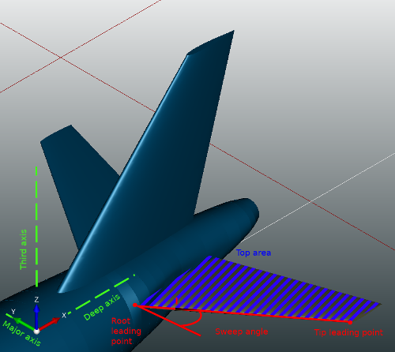
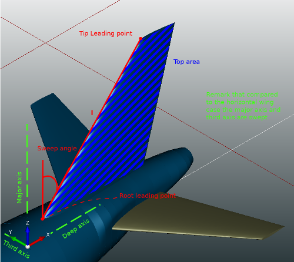

CPACSCreator high level parameters {#parameters_def}
==================================

Tigl framework uses multiple high-level parameter to simplify the editing of CPACS files. In this section, we will present the definition used by our functions in detail.   

@section sec_wing_param Wing Parameters Definition

@subsection sec_sweep Sweep angle 
Let **l** be the vector from the root leading point to the tip leading point. Let **l'** be the projection of **l** on the plane formed by the major axis and the deep axis. 
Then, the **sweep angle** of the wing is the smaller angle between **l'** and the major axis. 

 

 

@subsection sec_dihedral Dihedral angle
Let **l** be the vector from the root leading point to the tip leading point. Let **l'** be the projection of **l** on the plane formed by the major axis and the third axis. Then, the **dihedral angle** of the wing is the smaller angle between **l'** and the  major axis. 

@subsection sec_area Top area
Let **wing'** be the projection of the wing on the plane formed by the major axis and the deep axis. 
Then, the **top area** is the area of **wing'**.
     

@subsection sec_span Span
Let **B** be a bounding box around the wing where all the edges of the box are parallel either to the major axis, to the deep axis or to the third axis. 
Then the **span** is the the size of the box **B** along the major axis.
Remark: If the wing has a symmetry parameter, the "two" wings are present in the box. 

@subsection sec_half_span Half span
Let **B** be a bounding box around the wing where the symmetry parameter of the wing is not applied (if present). 
Then, the **half span** is the the size of the box **B** along the major axis.
Remark: In this case always exactly "one" wing is present in the box.     
     
@subsection sec_ar Aspect ratio 
aspect_ratio = 2 * pow(half_span, 2) / top_area  

@subsection sec_major Major Axis
The major axis is either the X axis, the Y axis or the Z axis of the world coordinate system. 
The goal is to define which axis of the world coordinate system is best suited to be used as the span axis. 
If the wing has a symmetry parameter, we define that the major axis has the only axis orthogonal to the symmetry plane. 
If the wing has no symmetry plane, we use a heuristic.
First, we define the deep axis as the axis that is more "used" by the chord vector of the wing elements, please see the subsection deep axis for more details. 
Then, we define the major axis between the two remaining axis as the axis that is more "used" by the leading edges of all segments of the wing.
To find out the most "used" axis by the leading edges, let **l** be the sum of all leading edges. 
Then, the most "used" axis is the coordinate axis that has the largest values in **l**. 
Remark: To make the addition in **l**, we use the absolute value to capture the delta on this axis. 

     
@subsection sec_deep Deep Axis
The deep axis is either the X axis, the Y axis or the Z axis of the world coordinate system. 
The goal of this axis is to define which axis of the world coordinate system is best suited to be used with the major axis to create the plane in which the top area is computed.
To define the deep axis, we first exclude the major axis. 
Then we choose, between the two remaining axis, the axis that is more "used" by the chord vector of the wing elements. 
To do this, let **v** be the addition of all the chord vectors, then the most "used" axis is the coordinate axis that has the higher values in **v**. 
Remark: To make the addition in **v**, we use the absolute value to capture the delta on this axis.  

@subsection sec_third Third Axis
The third axis is either the X axis, the Y axis or the Z axis of the world coordinate system. 
The goal of this axis is to define which axis of the world coordinate system is best suited to be used to represent the "high" of the wing.
To define the third axis, we simply exclude the major axis and the deep axis of the three possibilities. 

@subsection sec_root Root wing element
The root element is the "from element" of the first segment. 
Remark: We assume that the segments are ordered starting form the root in the CPACS file. 
If this is not the case, tigl library performs a reordering when the file is open. 

@subsection sec_tip Tip wing element
The tip element is defined as the element whose center is most distant from the root element center along the major axis. 

@subsection sec_rotation Wing Rotation    
The wing rotation is simply defined as the rotation in the wing transformation. 

@subsection sec_tee Trailing point of a wing element
Let **p** be the trailing point of the associated airfoil and **M** be the augmented matrix that represent all affine transformations applied on this wing element (element transformation, section transformation, positioning transformation, wing transformation, translation of parent). 
Then the trailing point **te** of this wing element is: **te = M * p**     
    
@subsection sec_lee Leading point of a wing element
Let **p** be the leading point of the associated airfoil and **M** be the augmented matrix that represent the all affine transformations applied on this wing element (element transformation, section transformation, positioning transformation, wing transformation, translation of parent). 
Then the leading point **le** of this wing element is: **le = M * p**     

@subsection sec_chord_vector Chord vector of a wing element 
The chord vector is defined as the vector pointing from the leading point, **le**, to the trailing point, **te**. 

@subsection sec_chord_pt Chord point of a wing element 
Let **v** be the chord vector and **le** be the the leading point of the wing element. 
Then we define the chord point **cp** at x percent as: **cp(x) = le + x*v**   
Remark: The percentage is given as a value between 0 and 1. 

@subsection sec_center_point Center point of a wing element 
The center point of an element is defined as the center of mass of the element wire. 
Here, the element wire is the associated airfoil after all affine transformations of the wing are applied to the airfoil profile.

@subsection sec_lea Trailing point of an airfoil
If the wing airfoil is described as a set of points, the trailing point is simply the first point of the airfoil description. 
If the wing airfoil is described as a function, the trailing edge point is currently not clearly defined yet.

 

@subsection sec_tea Leading point of an airfoil
If the wing airfoil is described as a set of points, the leading point is the point of the airfoil description that is the most distant of the airfoil trailing point.
If the wing airfoil is described as a function, the leading edge point is currently not clearly defined yet. 

